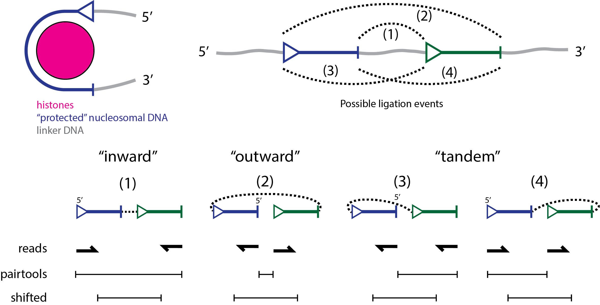

# Neighbor balancing and other tools for analyzing micro-C data

We found that standard ICE balancing results in unexpected correlations between contact frequencies and various
epigenetic marks. In particular, we found that active marks like H3K27ac or ATAC-seq were strongly correlated with
strong contacts with nearby nucleosomes (1-50 nucleosomes away), and repressive marks like H3K27me3 were correlated
with weak contacts with nearby nucleosomes. This is unexpected because intuitively, active regions should be more open
and therefore form fewer contacts. We hypothesize that this is due to the fact that ICE balancing assumes that all
windows have the same total contact frequency, making it impossible for the active regions to have fewer contacts.

This view is supported by Fig. 6A of the Nozaki et al., 2023 paper which shows that inhibition of deacetylase activity
(and therefore hyper-acetylation) leads to extended chromatin fibers and the view espoused by the Maeshima et al., 2024
review suggesting that boundary regions, active genes, and active regulatory elements are either on the surface of
domains or on loops outside of the contact domains.

To address this, we developed a new balancing protocol that we call "Neighbor Balancing". In this protocol, we
balance each window by the average contact frequency of its neighbors. This approach assumes that neighboring windows
should have similar contact frequencies across the genome.

Practically, this balancing results in open chromatin regions located at domain boundaries having fewer contacts than
closed chromatin regions located in the middle of a domain.

## Installation

Create a conda environment.
```bash
conda create -n neighbor
conda activate neighbor
```

Clone this repository, and install the package with pip.
```bash
git clone https://github.com/ZhangGroup-MITChemistry/neighbor-balance.git
cd neighbor-balance
pip install .
````

To perform the initial read alignment and conversion to pairs format, you will need to install the following packages:
```bash
conda install bioconda::sra-tools
conda install bioconda::bowtie2
conda install -c conda-forge -c bioconda pairtools
```

To run the tests you additionally need to install `pytest`:
```bash
conda install pytest
```
you can then run the tests with
```bash
cd tests
pytest
```


## Workflow

The below workflow shows how to process the data from Goel et al., 2023.

We start from fastq files downloaded from the SRA, align using bowtie2 and then convert to pairs format. If you prefer
a different aligner or specific protocol for, e.g. duplicate removal, you should feel free to use your own pipeline.
It is imperative, however, to check that the orientation of the reads in the final pairs file is consistent with that
depicted above or the mapping of reads to nucleosome windows will be incorrect.

## Download data and set environment variables
```bash
conda activate align
genome=mm39
index=~/ucsc/mm39/mm39
chromsizes=~/ucsc/mm39.chrom.sizes
captureregions=~/rcmc/captureregions_mm39.bed
root=~/rcmc/WT
```

Obtain the mm39 genome and create an index
```bash
cd ~/ucsc
wget https://hgdownload.soe.ucsc.edu/goldenPath/mm39/bigZips/mm39.chrom.sizes
wget https://hgdownload.soe.ucsc.edu/goldenPath/mm39/bigZips/mm39.fa.gz
sbatch --wrap="bowtie2-build mm39.fa.gz mm39 --threads 32" --cpus-per-task 34 --time 12:00:00
```

Get fastq files and unpack them
```bash
cd $root
prefetch -p --max-size 100GB SRX15946369 # WT BR1
prefetch -p --max-size 100GB SRX18646725 # WT BR2

for i in SRR*; do
    echo $i;
    cd $root/$i;
    fasterq-dump -p ${i}.sra;
done;
```

## Raw data to balanced contact maps

### Alignment and conversion to pairs format

Align the reads using "bowtie2" with the following options
- “–reorder": required for pairtools parse
- "–local –very-sensitive-local": Read ends could potentially continue past the ligation junction.
- "–maxins 1 –minins 1000000”: These constraints on the insert size are designed to be unsatisfiable, resulting in
no “concordantly” aligning reads. This removes a bias towards short-range inward-facing alignments.

Then convert to pairs format using “pairtools parse” with the following options
- “–walks-policy mask": Conservative option. Consider changing if you have longer reads.
- "–add-mapq –min-mapq 2”: This removes reads with low mapping quality with a threshold following the original paper.

```bash
for sra in SRR*; do
    cd $root/$sra;
    sbatch  --cpus-per-task 32 -t 24:00:00 -J $sra --dependency=SINGLETON \
      --wrap="bowtie2 -x $index --threads 32 -1 ${sra}_1.fastq -2 ${sra}_2.fastq --reorder --local --very-sensitive-local --maxins 1 --minins 1000000 | samtools view -bS - > noinsert_${sra}.bam";
    sbatch  --cpus-per-task 32 -t 24:00:00 -J $sra --dependency=SINGLETON \
      --wrap="samtools view -h noinsert_${sra}.bam | pairtools parse --add-columns mapq --walks-policy mask -c $chromsizes --assembly $genome --min-mapq 2 --drop-sam | pairtools sort -o default_noinsert_${sra}.pairs";
done;

# Merge pairs files after above is complete.
sbatch -J rcmc --cpus-per-task 9 \
  --wrap="pairtools merge SRR*/default_noinsert_SRR*.pairs -o all.pairs.gz"
```

### Remove duplicates

Duplicate reads are removed using “pairtools dedup” with option -“-max-mismatch
1”. This removes read pairs where both ends align to the same positions on the genome.

Many of these pairs are likely PCR or optical duplicates. However, given the high depth of sequencing, it is
likely that some of these pairs are true biological duplicates. Therefore, removing duplicates results in a systematic
bias against regions with especially high coverage, as there are only a limited number of unique reads that are possible
between two regions, so some duplicates are expected by chance.

See `duplicates.ipynb` for analysis of the effects of duplicate removal. The results suggest that the bias is not
substantial and that including duplicates would introduce a substantial amount of noise for low frequency interactions.
All things considered, it seems that removing duplicates is the best option.

```bash
sbatch -J rcmc --dependency=SINGLETON --cpus-per-task 9 \
  --wrap="pairtools dedup all.pairs.gz --max-mismatch 1 --mark-dups --output all.nodups.pairs.gz --output-stats all.dedup.stats"
```

### Extract pairs in capture regions

Following the original RCMC paper, only reads where both ends align uniquely to a capture region are retained.

```bash
sbatch -J rcmc --dependency=SINGLETON --cpus-per-task 10 \
  --wrap="zcat all.nodups.pairs.gz | python $script filter $chromsizes --regions $captureregions | gzip > select.nodups.pairs.gz"
```

### Shift reads depending on direction

A custom analysis script is used to shift the assigned positions to the most probable nucleosome center positions
according to the read pair orientation, as described below. The number of base pairs protected by a
nucleosome was set to 131 in agreement with previous studies.



* +/-: “inward”, result of ligation between the 3’ end of an upstream nucleosome and the 5’ end of a
downstream nucleosome, shift first + protected / 2, shift second - protected / 2

* -/+: “outward”, result of ligation between the 5’ end of an upstream nucleosome and the 3’ end of a
downstream nucleosome, shift first - protected / 2, shift second + protected / 2

* -/-: “tandem entry”, result of ligation between the 5’ end of an upstream nucleosome and the 5’ end of a
downstream nucleosome, shift first - protected / 2, shift second - protected / 2

* +/+: “tandem exit”, result of ligation between the 3’ end of an upstream nucleosome and the 3’ end of
a downstream nucleosome, shift first + protected / 2, shift second + protected / 2

To determine the average number of protected base pairs, we assessed which shifts maximize the concordance of peaks
between the four read directions. We found that a shift of 65 (corresponding to 130 bps of protected DNA) maximizes
the concordance. This is less than the 147 bp canonically considered to be protected by a nucleosome, but agrees with
the results from Ohno et al, 2019 (see `raw_data.ipynb`).

Orthogonal to this analysis, we also assessed the concordance of the inferred nucleosome positions with standard MNase
data. For each end of an RCMC read, the nucleosome position was inferred as being some shift (corresponding to half 
the length of the protected DNA) 3' of the 5' end of the read. Moreover, we considered which shift maximizes the 
concordance between the inferred nucleosome positions for read ends aligning to the plus and minus strands. In both
cases, we found that a shift of ~80, corresponding to 160 bp of protected DNA, maximizes the concordance
(see `nucleosomes.ipynb`).

It is not clear what causes this discrepancy, but, fortunately, the precise value of the shift does not have a major
impact on our modeling, as most reads will still be assigned to the same window.

```bash
sbatch -J rcmc --dependency=SINGLETON --cpus-per-task 10 \
  --wrap="zcat select.nodups.pairs.gz | python $script shift --protected-over-2 65 | python $script filter $chromsizes --regions $captureregions | gzip > select_corrected.nodups.pairs.gz"
```
Note that the reads need to be filtered again after shifting, as some reads may no longer align to the capture regions.

### Create maps with likely unligated inward reads removed

After shifting, we found that the abundances and distance-dependence of all read directions was concordant,
except for an overabundance of “inward” reads between adjacent nucleosomes. Note that these
“inward” reads are in the expected orientation for unligated DNA fragments and previous work suggests that
these reads arise from unligated DNA fragments that escape exonuclease mediated degradation.

To correct for the overabundance of close-range “inward” reads, we discard “inward” reads assigned to i+1 or
i+2 nucleosomes and multiply the remaining counts by 4/3. This operation assumes that true inward ligation
events occur at approximately the same rate as other types of junctions. Supporting this assumption,
The overall abundance as a function of genomic separation is approximately the same across read directions for
separations greater than 300 bases and the contact frequencies between pairs of windows when only considering
reads in specific orientations are highly correlated (see `read_direction.ipynb`).

```bash
# Create separate pairs files for inward, outward, tandem entry, and tandem exit reads.
for direction in inward outward tandementry tandemexit; do
    sbatch --wrap="zcat select_corrected.nodups.pairs.gz | python $script filter $chromsizes --direction $direction | gzip > select_corrected_${direction}.nodups.pairs.gz" --cpus-per-task 10
done;

# Create maps for each pairs file.
for name in select_corrected select_corrected_inward select_corrected_outward select_corrected_tandementry select_corrected_tandemexit; do
    sbatch --cpus-per-task 10 --time 72:00:00 \
      --wrap="zcat $name.nodups.pairs.gz | cooler cload pairs -c1 2 -p1 3 -c2 4 -p2 5 $chromsizes:200 - $name.cool; \
              cooler zoomify --balance  --resolutions 200 --out $name.mcool $name.cool"
done;

# Create a map that is corrected for unligated inward reads
sbatch  --cpus-per-task 10 \
  --wrap="python $script combine select_corrected.cool select_corrected_inward.cool select_corrected_minus_inward.cool; \
          cooler zoomify --balance  --resolutions 200 --out select_corrected_minus_inward.mcool select_corrected_minus_inward.cool"
```

## ICE balancing with interpolation and capture probe masking

This procedure is specifically for region capture micro-C data and is implemented to work using dense matrices as
opposed to cooler files. 

### Interpolating masked regions of the contact map

The contact map has masked values for windows with low coverage and for entries not covered by capture probes as
described above. In ICE balancing, one typically assumes that these masked values are zero. However, this is problematic
because in our simulations these regions will not have a contact frequency of zero, resulting in these windows having
an artificially higher marginal contact frequency.

To address this, we add a round of ICE balancing where we interpolate the masked values between each
step of balancing. To preserve the average contact frequency as a function of genomic separation, we interpolate the
contact map by interpolating along each diagonal. This round is followed by another round of ICE balancing with where
the masked values are interpolated at the beginning and not modified during the balancing. This ensures convergence.

### Accounting for gaps in capture probes

The capture probes used in RCMC do not cover the entire regions of interest. From the paper:
"Once loci had been selected, 80-mer probes were designed to tile end-to-end without overlap across the capture loci
through Twist Bioscience (Extended Data Fig. 1c). Probes with high predicted likelihoods of off-target pull-down
(for example, such as those in high-repeat regions) were masked and removed from the probe tiling, and probe coverage
was double-checked to ensure the inclusion of key genomic features (for example, all promoters and CTCF sites in the
locus) before finalization."

This is problematic because this introduces biases that are not multiplicative as is assumed by ICE balancing, but
additive. These biases are additive because a ligated product can be captured if either of its ends are captured, so
the probability of a ligated product being captured is roughly the sum of the probabilities of its ends being captured.

In theory, we could attempt to estimate these additive biases, but a simpler option is to simply mask entries in the
contact matrix for which both ends are not covered by capture probes. (It would also be reasonable to mask entire
rows/columns with poor capture probe coverage, but, empirically, this does not seem to be necesary.)

### Accounting for flanking regions using expected contacts

Applying ICE balancing as originally described biases windows near the edge of a region of interest to be too high.
Consider, the window at the very end start of the region of interest. Presumably, this window forms approximately the
same number of contacts with windows upstream and downstream of it. However, since the upstream windows are not
included in the region of interest, they will not contribute to the window's marginal contact count during ICE balancing.
To compensate for this, ICE balancing will increase all of this windows contact frequencies by approximately a factor
of 2.

To address this, we can add values to each marginal to approximate the number of contacts that are formed with flanking
regions. To do this, we compute the contact frequency as a function of genomic separation. Then, for each window, we
sum the contact frequencies with windows outside of the region of interest and add this to the window's marginal.

Alternatively, we considered the possibility that the contact maps should be normalized based on genome-wide micro-C data. The
idea being that the RCMC data only considers a subset of the genome, so if the ratio of in-region to out-of-region
contacts differs between windows, then ICE balancing will yield incorrect results. We found that all-in-all, different
windows have similar ratios of in-region to out-of-region contacts, so this is not a major concern.

## Neighbor balancing

In theory, Neighbor Balancing could be applied without ever performing ICE balancing. However, in practice, the first
diagonal on its own contains too much noise to provide useful normalization, for instance, leading to strong stripes
for rows that happen to have low values of the diagonal. We found that first performing ICE normalization, then
smoothing the first off-diagonal, and only then applying neighbor balancing produces a smooth contact map with local
densities that are highly correlated with epigenetic marks.

See:
* `contact_map_comparison.ipynb` for a comparison of the contact maps with different normalization protocols.
* `analysis/normalization` for analysis of synthetic systems with different normalization protocols.


# Extract "MNase track" from the pairs file
We can get a "MNase track" by considering the positions of each read pair independently. This has an advantage over
typical MNase in that the sequencing is much deeper. However, a disadvantage is that, since we are not sequencing the
ends of each fragment of nucleosome protected DNA (as in typical MNase), we do not know the appropriate shift to apply
to estimate the center of the nucleosome. This shift depends on the thoroughness of the digestion, so needs to be fit
to each dataset. This can be done by creating separate tracks for reads that are on the plus and minus strands and
then identifying the shift that maximizes the correlation between the two tracks. However, this is complicated by the 
fact that the read position distributions are skewed and the shift maximizing the correlation is not necessarily the
most useful. Perhaps there is a metric other than cross correlation that could be helpful?
Nonetheless, it is useful to do this analysis. Separate tracks for each strand can be computed by adding `grep +`
or `grep -` before the sort command in the following script (here a `--shift` of 0 should be used). The ideal shift can
then be applied by setting the `--shift` option. In lack of a better estimate, a shift of 73 is used here which
corresponds to half the 147 bp typically considered to be protected by a nucleosome.

See `nucleosomes.ipynb` for analysis of the results.

```bash
chromsizes=~/ucsc/mm39.chrom.sizes
sbatch -J mnase --cpus-per-task 10 \
    --wrap="zcat ../WT_BR1/all.nodups.pairs.gz |
    python ~/na_genes/na_genes/microc/pairs_to_bed.py $chromsizes --shift 73 | \
    sort -k1,1 -k2,2n | \
    bedtools genomecov -i - -g $chromsizes -5 -bg > all.nodups.shift73.bg"
sbatch -J mnase --dependency=SINGLETON \
    --wrap="bedGraphToBigWig all.nodups.shift73.bg $chromsizes all.nodups.shift73.bw"
```

# Analysis
* raw_data.ipynb: analysis of the pairs formatted data and conversion to windows.
* contact_map_analysis.ipynb: analysis of scaling factors and expected contacts.
* contact_map_compare.ipynb: comparison of the contact maps with different preprocessing steps.
* contact_map_correlations.ipynb: correlations between reads with different directions.
* duplicates.ipynb: analysis of the effects of duplicate removal.
* nucleosomes.ipynb: analysis of MNase-from-RCMC data. Specifically, analysis of the shift that maximizes the
  correlation between the plus and minus strands.
* read_direction.ipynb: do different read directions have different contact maps?
* smoothing.ipynb: attempts to smooth the contact maps.
* tmcc.ipynb: analysis of t-mcc data. there are no clear takeaways from this analysis.
