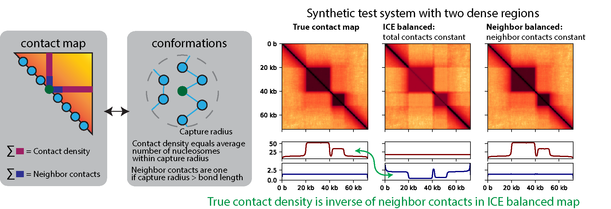
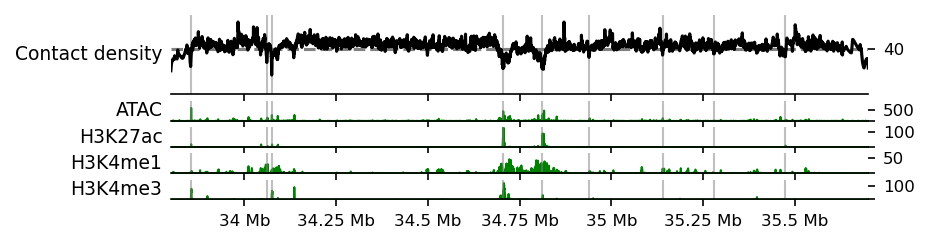
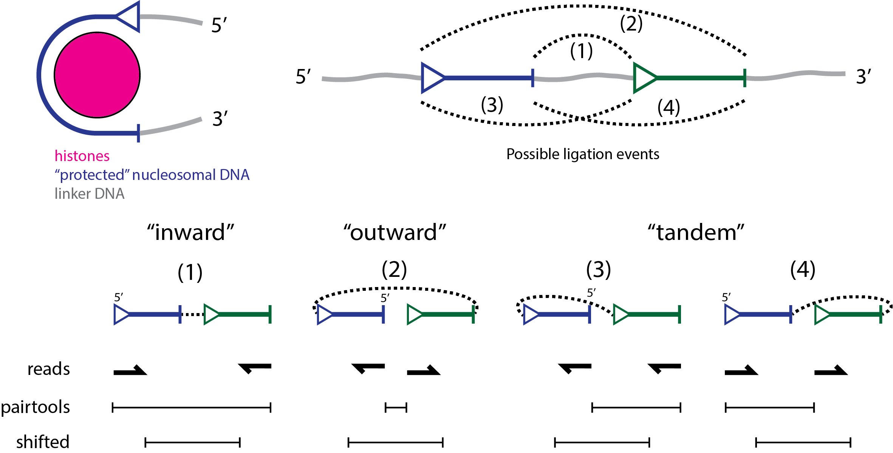
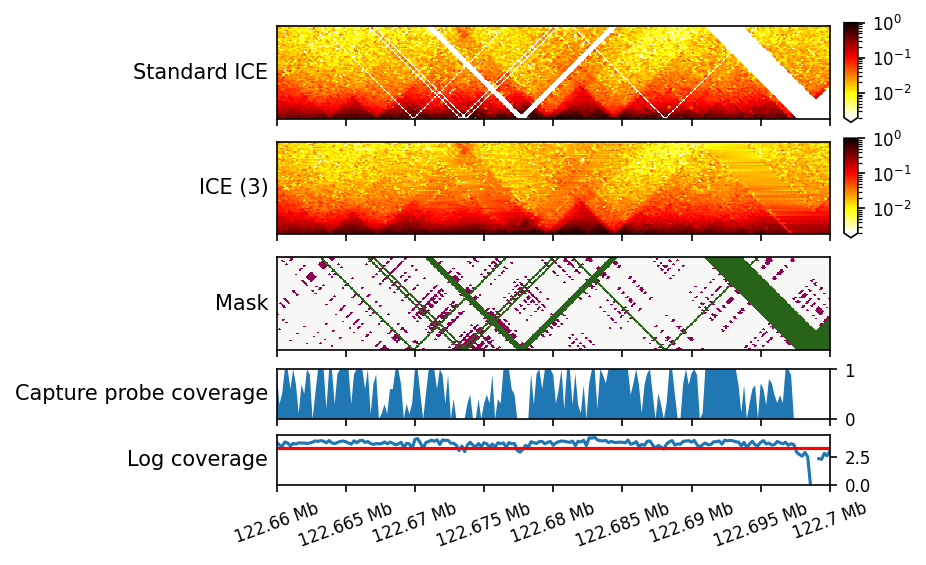
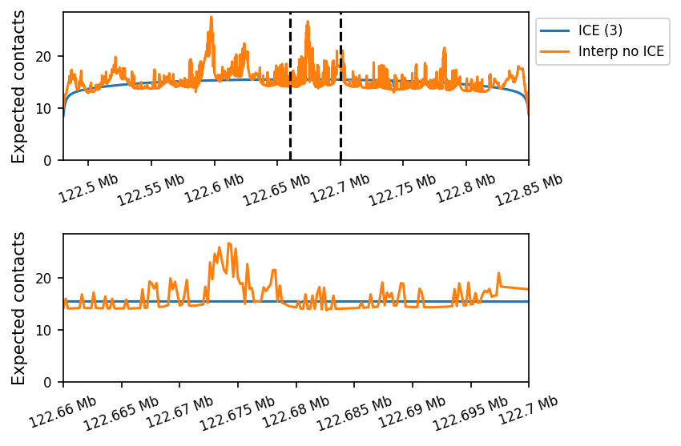
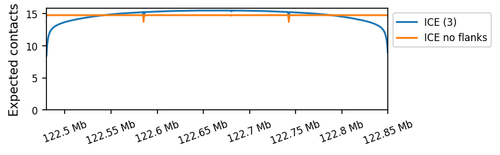

# Neighbor balancing of micro-C data



Standard micro-C balancing approaches, including ICE and KR balancing, are rooted in the assumption that all genomic
windows have the same contact density, i.e. the sum of all rows/columns are the same.
This assumption implies that the average local density, defined as the average number of windows in contact with a
given window, is the same for all positions. This rules out the possibility of some windows being more loosely or
densely packed than others.

Neighbor balancing uses the contact frequencies between neighboring windows to infer variations in contact density.
The assumption is that neighboring windows are always in contact and should thereby all have a contact
frequency of 1. Neighbor balancing achieves this by dividing each row/column by the square root of the average of its
neighbor contact frequencies.

```math
C^{(\text{neighbor})}_{ij} = \frac{C_{ij}}{\sqrt{\frac{1}{2} ( C_{i,j-1} + C_{i,j+1}) \frac{1}{2} (C_{i-1,j} + C_{i+1,j})}}
```

In practice, we've observed that this procedure results in regions enriched for active epigenetic marks having lower
contact densities, aligning with the expectation that these regions are more open.
Here is an example of the contact density inferred by neighbor balancing for the
sox2 locus in mouse embryonic stem cells. The sox2 promoter and enhancer (SCR) are located
at the two dips in contact density around 34.75 Mb.



## Installation

Create a conda environment. (This can be skipped if you already have an environment with the
required packages installed, see pyproject.toml.)
```bash
conda create -n neighbor pip python
conda activate neighbor
```

Clone this repository, and install the package with pip.
```bash
git clone https://github.com/ZhangGroup-MITChemistry/neighbor-balance.git
cd neighbor-balance
pip install .
```

To perform the initial read alignment and conversion to pairs format, you will additionally need to install `sra-tools`,
`bowtie2`, and `pairtools`.

To run the tests, you additionally need to install `pytest`, you can then run the tests with
```bash
cd tests
pytest
```

## Usage

### Run modified micro-C processing pipeline

While the actual neighbor balancing procedure is simple, we've found that there are several changes in
the processing pipeline that are necessary to achieve good results. This unfortunately requires starting from a pairs
or fastq file. The updated pipeline can be run through snakemake (see `Snakefile`). The commands are also written out
in `run_processing.sh`, if you prefer not to set up snakemake, but note that this "script" is more a list of commands
that should be run individually.
See the below section "Raw data to contact map" for details and justification of the changes.

**Applying neighbor balancing to contact maps computed without these changes will result in incorrect results.**

### Neighbor balancing for a genome-wide dataset

To compute the neighbor balancing weights for a genome-wide dataset, run the following command:

```bash
neighbor-balance neighbor-balance-cooler example.mcool
```

This will store an additional column of weights called `weight_neighbor`, which can be used to weight the contact
frequencies.

Note that you will need to explicitly specify to use the neighbor balanced weights in subsequent steps,
e.g.:

```python
import cooler
resolution = 25600
cool = 'example.mcool'
region = 'chr1'
clr = cooler.Cooler(f'{cool}::/resolutions/{resolution}')
contact_map = clr.matrix(balance='weight_neighbor').fetch(region)
```

### Neighbor balancing for a region-capture dataset

For region-capture datasets, we recommend instead using the below procedure. Most importantly, this procedure masks
pixels that are not covered by capture probes on either end and interpolates masked values between each step of
balancing. See the section "ICE balancing with interpolation and capture probe masking" for details.

Compute the ice balanced and interpolated contact map with the following command:
```bash
neighbor-balance region-balance output.npz example.mcool 'chr8:84,900,000-85,800,000'
```

Load the contact map as a numpy array and run neighbor balancing (very fast for dense matrices):
```python
import numpy as np
from neighbor_balance.neighbor import normalize_contact_map_neighbor
loaded = np.load('output.npz', allow_pickle=True)
ice_contact_map = loaded['array']
metadata = loaded['metadata'].item()
neighbor_contact_map = normalize_contact_map_neighbor(ice_contact_map)
```

## Raw data to contact map

### Alignment and conversion to pairs format

Align the reads using `bowtie2` with the following options
- `–reorder`: required for pairtools parse
- `–local –very-sensitive-local`: Read ends could potentially continue past the ligation junction.
- `–maxins 1 –minins 1000000`: These constraints on the insert size are designed to be unsatisfiable, resulting in
no concordantly aligning reads. This removes a bias towards short-range inward-facing alignments.

Then convert to pairs format using “pairtools parse” with the following options
- `–walks-policy mask`: Conservative option. Consider changing if you have longer reads.
- `–add-mapq –min-mapq 2`: This removes reads with low mapping quality with a threshold following the original paper.

### Remove duplicates

Duplicate reads are removed using “pairtools dedup” with option -“-max-mismatch
1”. This removes read pairs where both ends align to the same positions on the genome.

Many of these pairs are likely PCR or optical duplicates. However, given the high depth of sequencing in RCMC, it is
likely that some of these pairs are true biological duplicates. Therefore, removing duplicates results in a systematic
bias against regions with especially high coverage, as there are only a limited number of unique reads that are possible
between two regions, so some duplicates are expected by chance.

### Extract pairs in capture regions

When processing a region-capture dataset, only reads where both ends align uniquely to a capture region are retained,
following the original RCMC paper.

### Shift reads depending on orientation

A custom analysis script is used to shift the assigned positions to the most probable nucleosome center positions
according to the read pair orientation, as described below. The number of base pairs protected by a
nucleosome was set to 131 in agreement with previous studies.



* +/-: “inward”, result of ligation between the 3’ end of an upstream nucleosome and the 5’ end of a
downstream nucleosome, shift first + protected / 2, shift second - protected / 2

* -/+: “outward”, result of ligation between the 5’ end of an upstream nucleosome and the 3’ end of a
downstream nucleosome, shift first - protected / 2, shift second + protected / 2

* -/-: “tandem entry”, result of ligation between the 5’ end of an upstream nucleosome and the 5’ end of a
downstream nucleosome, shift first - protected / 2, shift second - protected / 2

* +/+: “tandem exit”, result of ligation between the 3’ end of an upstream nucleosome and the 3’ end of
a downstream nucleosome, shift first + protected / 2, shift second + protected / 2

To determine the average number of protected base pairs, we assessed which shifts maximize the concordance of peaks
between the four read directions. We found that a shift of 65 (corresponding to 130 bps of protected DNA) maximizes
the concordance. This is less than the 147 bp canonically considered to be protected by a nucleosome, but agrees with
the results from Ohno et al, 2019. It is not clear what causes this discrepancy, but, fortunately,
the precise value of the shift does not have a major
impact on our modeling, as most reads will still be assigned to the same window.

### Remove likely unligated inward reads

After shifting, we found that the abundance and distance-dependence of all read directions was concordant,
except for an overabundance of “inward” reads between adjacent nucleosomes. Note that these
“inward” reads are in the expected orientation for unligated DNA fragments, and previous work suggests that
these reads arise from unligated DNA fragments that escape exonuclease mediated degradation.

To correct for the overabundance of close-range “inward” reads, we discard “inward” reads assigned to i+1 or
i+2 nucleosomes and multiply the remaining counts by 4/3. This operation assumes that true inward ligation
events occur at approximately the same rate as other types of junctions.

## ICE balancing with interpolation and capture probe masking

This procedure is specifically for region capture micro-C data and is implemented to work using dense matrices as
opposed to cooler files.



### Accounting for gaps in capture probes

The capture probes used in RCMC do not cover the entire region of interest to prevent high off-target pull downs.
This introduces biases that are additive, which is problematic because ICE balancing assumed multiplicative biases.
The biases are additive because a ligated product can be captured if either of its ends are captured, so
the probability of a ligated product being captured is roughly the sum of the probabilities of its ends being captured,
not their product. This results in pixels for which both ends are not covered by capture probes having an artificially
low contact frequency.

These cases are not always masked using standard filters, e.g. that each row has a minimum total number of reads,
because high coverage can be obtained if the other end of the ligated product is captured. Therefore, we
explicitly mask pixels for which both ends are not covered by capture probes.

This masking step is crucial for neighbor balancing. If not performed, gaps in capture probes more than 1 nucleosome
wide result in artificially low neighbor contact frequencies, creating very small neighbor factors and ultimately
stripes in the contact map.

### Interpolating masked regions of the contact map

The contact map has masked values for windows with low coverage and for entries not covered by capture probes as
described above. In ICE balancing, one typically assumes that these masked values are zero. However, this is problematic
because in our simulations these regions will not have a contact frequency of zero, resulting in windows having
an artificially high marginal contact frequency.



To address this, we add a round of ICE balancing where we interpolate the masked values between each
step of balancing. To preserve the average contact frequency as a function of genomic separation, we interpolate the
contact map by interpolating along each diagonal. This round is followed by another round of ICE balancing with where
the masked values are interpolated at the beginning and not modified during the balancing, ensuring convergence.

### Accounting for flanking regions using expected contacts

Standard ICE balancing biases windows near the edge of the capture region to be too high.
Consider, the window at the very end start of the region of interest. Presumably, this window forms approximately the
same number of contacts with windows upstream and downstream of it. However, since the upstream windows are not
included in the region of interest, they will not contribute to the window's marginal contact count during ICE balancing.
To compensate for this, ICE balancing will increase all of this window's contact frequencies by approximately a factor
of 2.



To address this, we can add values to each marginal to approximate the number of contacts that are formed with flanking
regions. To do this, we compute the contact frequency as a function of genomic separation. Then, for each window, we
sum the contact frequencies with windows outside of the capture region and add this to the window's marginal.


# Bonus

## Plot base resolution P(s) curve

Inspecting the very short range P(s) curve is useful for diagnosing batch effects.

```bash
neighbor-balance base-ps /path/to/pairs.gz --nrows 100_000_000
```

```python
from scipy.ndimage import gaussian_filter1d
import pandas as pd
import matplotlib.pyplot as plt

sigma = 10
fname = '/path/to/pairs.gz.base_ps.csv'

counts = pd.read_csv(fname)
for direction in ['inward', 'outward', 'tandem_entry', 'tandem_exit']:
    plt.plot(counts['distance'], gaussian_filter1d(counts[direction], sigma=sigma), label=direction)
plt.yscale('log')
plt.xscale('log')
plt.xlim(50)
plt.legend()
plt.show()
```

## Extract "MNase track" from the pairs file
We can get a "MNase track" by considering the positions of each read pair independently. This has an advantage over
typical MNase in that the sequencing is much deeper. However, a disadvantage is that, since we are not sequencing the
ends of each fragment of nucleosome protected DNA (as in typical MNase), we do not know the appropriate shift to apply
to estimate the center of the nucleosome. This shift depends on the thoroughness of the digestion, so needs to be fit
to each dataset. This can be done by creating separate tracks for reads that are on the plus and minus strands and
then identifying the shift that maximizes the correlation between the two tracks. However, this is complicated by the 
fact that the read position distributions are skewed and the shift maximizing the correlation is not necessarily the
most useful. Perhaps there is a metric other than cross correlation that could be helpful?
Nonetheless, it is useful to do this analysis. Separate tracks for each strand can be computed by adding `grep +`
or `grep -` before the sort command in the following script (here a `--shift` of 0 should be used). The ideal shift can
then be applied by setting the `--shift` option. In lack of a better estimate, a shift of 73 is used here which
corresponds to half the 147 bp typically considered to be protected by a nucleosome.

```bash
chromsizes=~/ucsc/mm39.chrom.sizes
zcat ../WT_BR1/all.nodups.pairs.gz \
| python pairs_to_bed.py $chromsizes --shift 73 \
| sort -k1,1 -k2,2n \
| bedtools genomecov -i - -g $chromsizes -5 -bg \
> all.nodups.shift73.bg

bedGraphToBigWig all.nodups.shift73.bg $chromsizes all.nodups.shift73.bw
```
